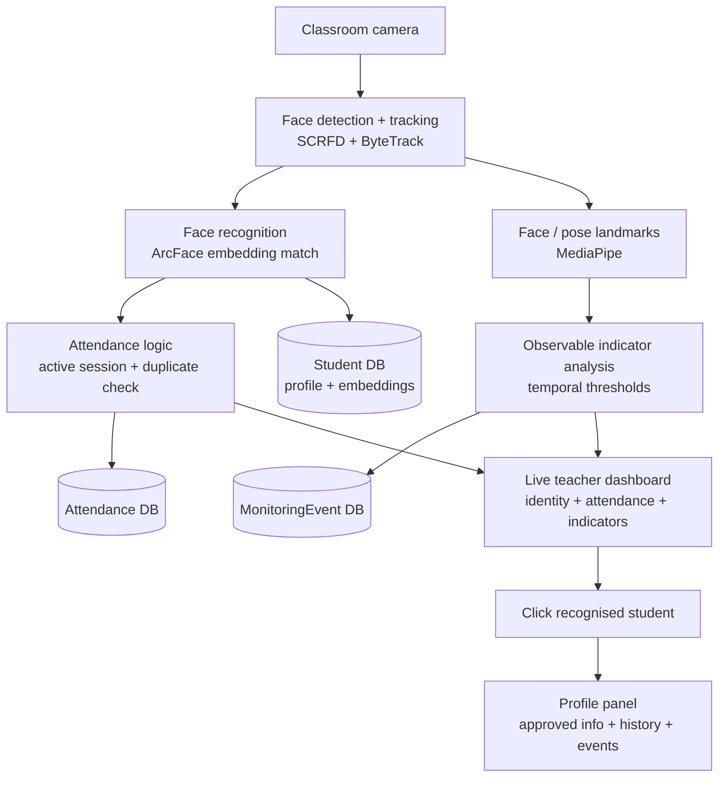

# AI-Based Smart Classroom Monitoring & Attendance System

Reference implementation of the BSc. IT final-year project proposal
(*AI-Based Smart Classroom Monitoring Using Facial Recognition and Sentiment
Analysis*). It recognises enrolled students from a live classroom feed, records
attendance once per session, tracks students across frames, reports a small set
of **observable** engagement indicators, and lets an authorised teacher click a
recognised student to see approved information.

> The system reports *observable conditions* (looking away, head-down, high
> movement, face not visible, possible drowsiness) with duration/confidence.
> It does **not** infer emotion, engagement, personality or academic ability.
> Every result is subject to teacher review.

## Architecture



| Layer | Technology |
|-------|-----------|
| Web app | Django 5, PostgreSQL (SQLite for quick runs) |
| Detection / embeddings | InsightFace `buffalo_l` (SCRFD + ArcFace), ONNX Runtime |
| Tracking | Self-contained ByteTrack-style tracker (Kalman + Hungarian) |
| Landmarks | MediaPipe Face Landmarker (head pose + blendshapes) |
| Streaming | OpenCV capture → MJPEG over `StreamingHttpResponse` |

## Layout

```
config/            Django project (settings, urls)
apps/
  accounts/        teacher/admin roles, login, password management
  students/        Student + FaceEmbedding, enrollment, consent
  classes/         CourseClass + ClassSession (active-session selection)
  attendance/      Attendance model + first-recognition / duplicate logic
  monitoring/      MonitoringEvent model + persistence helpers
  dashboard/       live view, MJPEG feed, tracks/profile JSON, worker runtime
cv_pipeline/       camera → detect → track → recognise → landmarks → indicators
templates/  static/
```

## Quick start (no camera; PostgreSQL, or SQLite for a fast start)

```bash
python -m venv .venv && .venv\Scripts\activate      # Windows
pip install -r requirements.txt                      # or the core subset, see docs/SETUP.md
copy .env.example .env                                # set DB_PASSWORD (PostgreSQL) or DB_ENGINE=sqlite; see docs/SETUP.md
python manage.py migrate
python manage.py seed_demo                            # admin/admin12345, teacher/teacher12345
python manage.py runserver
```

Open <http://127.0.0.1:8000/> → sign in → **Students** → enrol a few volunteers
with consented photos → **Dashboard** → open the seeded session → **Activate
session** → **Start camera**.

## Typical workflow

1. **Enrol** students (`Students → Enrol new student`, or
   `python manage.py enroll_student --id 22BSCIT001 --name "Asha Rai" --images data/enroll/asha/*.jpg`).
   Uploading photos records consent; each usable photo becomes one ArcFace template.
2. **Create a session** for a class and open its live view.
3. **Activate** the session — the first confident recognition of each student
   writes exactly one attendance row (duplicates are rejected at the DB level).
4. **Monitor** — bounding boxes show identity, attendance tick and the current
   observable indicator. Conditions must persist past a threshold
   (`cv_pipeline/config.py`) before they become `MonitoringEvent`s.
5. **Click** a recognised student for the approved profile panel (identity,
   academic fields, attendance %, history, recent events).
6. **Correct** anything wrong on the attendance sheet; **Close** the session.

Headless run against a recorded clip:

```bash
python manage.py run_pipeline --session 1 --source data/clips/lecture.mp4 --show
```

## Tests

Indicator thresholds, neutral camera angles, and measurement export are described
in [the calibration guide](docs/CALIBRATION.md). The live view uses an explicit
uncertain state for insufficient measurements and reports prolonged eye closure.

```bash
python manage.py test apps.attendance cv_pipeline
```

Covers the attendance guarantees (single record, duplicate rejection, manual
correction/audit) and the CV logic that runs without model weights (tracker id
stability, unknown-state retention, identity voting, duration thresholds).

## Evaluation targets (from the proposal)

≥90% face-ID accuracy in normal light · ≥98% duplicate-free attendance once
recognised · F1 ≥ 0.80 for the main indicators · ≥8 FPS on the target laptop ·
profile panel < 1.5 s. These are calibration targets for Months 3–6, not
guarantees. See `docs/EVALUATION.md`.

## Legal / ethical

Face images and templates are personal data under Nepal's Privacy Act, 2075.
This build keeps consent flags, stores only the fields the prototype needs, does
not retain continuous raw video, restricts access by role, and provides a
withdrawal/deletion path (delete the `Student` — embeddings cascade). See
`docs/PRIVACY.md`.
